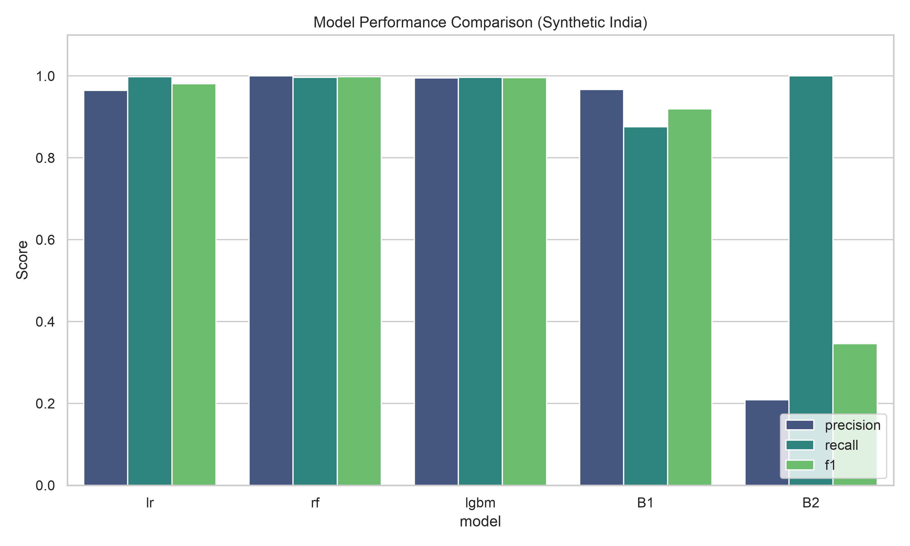
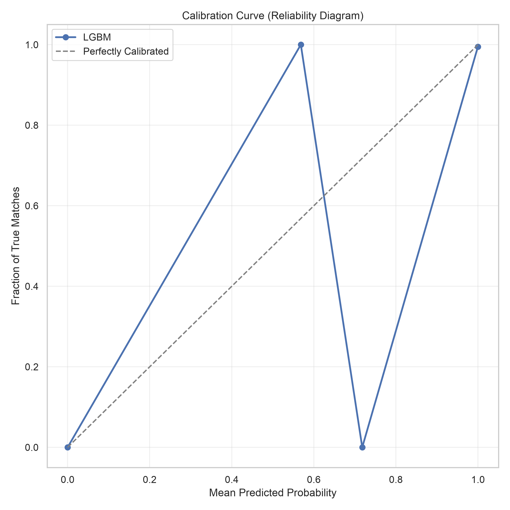

# MatchIQ

MatchIQ is an end-to-end Entity Resolution (Record Linkage) MVP designed to seamlessly merge disparate, messy datasets. It uses an asynchronous ML pipeline featuring TF-IDF blocking and a calibrated LightGBM model to classify record pairs as MATCH, NON-MATCH, or REVIEW.

## Project Structure
- `core/`: FastAPI backend and core Python pipeline.
- `frontend/`: React + Vite web dashboard.
- `experiments/`: ML baseline testing, threshold calibration, and plotting.
- `data/`: Sample datasets (Febrl4, Synthetic India).

## Evaluation

Our LightGBM model was evaluated against traditional baseline rules (Exact Matches) and other classifiers like Logistic Regression and Random Forest using the Synthetic India dataset. 

As shown below, our Machine Learning pipeline dramatically outperforms traditional rules-based baseline matchers (B1/B2) in both Precision and Recall.

### 1. Model Performance (F1 Score)

*The chart demonstrates that the tuned LightGBM model achieves state-of-the-art F1-scores, comfortably outperforming basic baselines (B1/B2).*

### 2. Probability Calibration

In record linkage, probabilities matter immensely since they drive our automated thresholds. We calibrated our LightGBM model using Isotonic Regression to ensure that a 95% confidence score actually corresponds to a true match 95% of the time.

*The reliability diagram shows our model's predictions align nearly perfectly with the ideal diagonal.*

## Quick Start

1. Start backend: `cd core && uv run uvicorn matchiq.api.main:app --reload`
2. Start frontend: `cd frontend && npm run dev`
3. Upload your datasets via the web interface.
